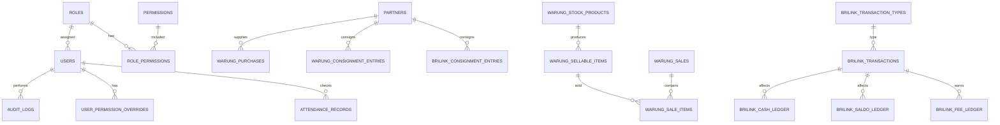

# ERD Mermaid

Status: **FINAL V1 BASELINE**

```mermaid
erDiagram
    USERS ||--o{ AUDIT_LOGS : performs
    ROLES ||--o{ USERS : assigned
    ROLES ||--o{ ROLE_PERMISSIONS : has
    PERMISSIONS ||--o{ ROLE_PERMISSIONS : included
    USERS ||--o{ USER_PERMISSION_OVERRIDES : has

    PARTNERS ||--o{ WARUNG_PURCHASES : supplies
    PARTNERS ||--o{ WARUNG_CONSIGNMENT_ENTRIES : consigns
    PARTNERS ||--o{ BRILINK_CONSIGNMENT_ENTRIES : consigns

    WARUNG_STOCK_PRODUCTS ||--o{ WARUNG_SELLABLE_ITEMS : produces
    WARUNG_SELLABLE_ITEMS ||--o{ WARUNG_SALE_ITEMS : sold
    WARUNG_SALES ||--o{ WARUNG_SALE_ITEMS : contains

    BRILINK_TRANSACTION_TYPES ||--o{ BRILINK_TRANSACTIONS : type
    BRILINK_TRANSACTIONS ||--o{ BRILINK_CASH_LEDGER : affects
    BRILINK_TRANSACTIONS ||--o{ BRILINK_SALDO_LEDGER : affects
    BRILINK_TRANSACTIONS ||--o{ BRILINK_FEE_LEDGER : earns

    USERS ||--o{ ATTENDANCE_RECORDS : checks
```
